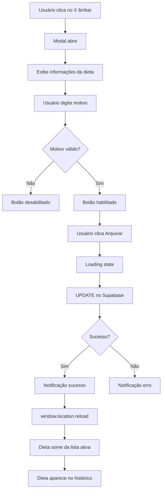

# 🍽️ Sistema de Arquivamento de Dietas - Documentação Completa

## ✅ Status da Implementação
**CONCLUÍDO** - Sistema completo de arquivamento de dietas implementado com sucesso!

---

## 📋 Resumo da Implementação

O sistema de arquivamento de dietas foi implementado seguindo o mesmo padrão estabelecido para dispositivos, exames, medicações, procedimentos e culturas. Agora **todas as 6 entidades clínicas** possuem sistema de arquivamento completo.

---

## 🗂️ Arquivos Criados/Modificados

### ✨ Novo Arquivo Criado

#### 1. **ArchiveDietModal.tsx**
**Localização:** `components/modals/diets/ArchiveDietModal.tsx`

**Funcionalidades:**
- Modal com tema âmbar (amber) para arquivar dietas
- Validação de motivo obrigatório
- Exibe informações da dieta (tipo, data início, volume)
- Integração com Supabase para atualizar `dietas_pacientes`
- Estados de loading durante submissão
- Callback `onSuccess` para recarregar página

**Código Principal:**
```typescript
const { error } = await supabase
    .from('dietas_pacientes')
    .update({
        is_archived: true,
        arquivado_por_id: user.id,
        motivo_arquivamento: archiveReason.trim()
    })
    .eq('id', diet.id);
```

---

### 🔧 Arquivos Modificados

#### 2. **components/modals/diets/index.ts**
**Alteração:** Adicionado export do `ArchiveDietModal`
```typescript
export { ArchiveDietModal } from './ArchiveDietModal';
```

#### 3. **components/modals/index.ts**
**Alteração:** Re-exportado `ArchiveDietModal` no módulo principal
```typescript
export { 
    AddDietModal, 
    EditDietModal, 
    AddDietRemovalDateModal, 
    EditDietRemovalDateModal, 
    ArchiveDietModal // ← NOVO
} from './diets';
```

#### 4. **App.tsx** (Múltiplas Modificações)

##### a) Import Lazy (Linha ~48)
```typescript
const ArchiveDietModal = lazy(() => 
    import('./components/modals').then(m => ({ default: m.ArchiveDietModal }))
);
```

##### b) Estado do Modal (Linha ~2168)
```typescript
const [archiveDietModal, setArchiveDietModal] = useState<Diet | null>(null);
```

##### c) Estado de Dietas Arquivadas (Linha ~705)
```typescript
const [archivedDiets, setArchivedDiets] = React.useState<any[]>([]);
```

##### d) Categoria de Eventos (Linha ~731)
```typescript
eventCategories = {
    // ... outras categorias
    'Arquivamentos Dietas': 'Dieta Arquivada' // ← NOVO
}
```

##### e) useEffect para Buscar Dietas Arquivadas (Linha ~1214)
```typescript
React.useEffect(() => {
    const fetchArchivedDiets = async () => {
        if (!patientId) return;
        try {
            const { data, error } = await supabase
                .from('vw_dietas_detalhado')
                .select('*')
                .eq('paciente_id', patientId)
                .eq('is_archived', true);
            
            if (!error && data) {
                setArchivedDiets(data);
            }
        } catch (err) {
            console.warn('Erro ao buscar dietas arquivadas:', err);
        }
    };
    fetchArchivedDiets();
}, [patientId]);
```

##### f) Integração no Timeline (Linha ~1587)
```typescript
archivedDiets.forEach(diet => {
    const dataArquivamento = diet.created_at;
    events.push({
        timestamp: dataArquivamento || new Date().toISOString(),
        icon: RecycleIcon,
        description: `[DIETA_ARQUIVADA] 🍽️ Dieta Arquivada
📋 Tipo: ${diet.tipo}
${diet.volume ? `💧 Volume: ${diet.volume} ml\n` : ''}
${diet.vet ? `⚡ VET: ${diet.vet} kcal/dia\n` : ''}
📝 Motivo do Arquivamento: ${diet.motivo_arquivamento || 'Não informado'}
👨‍⚕️ Arquivado por: ${diet.nome_arquivador || 'Sistema'}
📅 Arquivado em: ${dataArquivamento ? new Date(dataArquivamento).toLocaleString('pt-BR') : 'N/A'}`,
        hasTime: true,
    });
});
```

##### g) Dependência do useMemo (Linha ~1615)
```typescript
}, [patient, tasks, diagnostics, diuresisData, balanceData, dietsData, 
    alertsData, alertCompletions, alertJustifications, archivedAlerts, 
    archivedDevices, archivedExams, archivedMedications, archivedProcedures, 
    archivedCultures, archivedDiets, resolvedDiagnostics]); // ← archivedDiets adicionado
```

##### h) Mapeamento de Categoria (Linha ~1974)
```typescript
const categoryMap = {
    // ... outros mapeamentos
    '[DIETA_ARQUIVADA]': 'Arquivamentos Dietas' // ← NOVO
};
```

##### i) Botão Âmbar de Arquivar (Linha ~2673)
**ANTES:**
```typescript
{!diet.data_remocao ? (
    <button>Registrar Retirada</button>
) : (
    <button className="text-red-600">❌ Delete</button> // ← Botão vermelho
)}
```

**DEPOIS:**
```typescript
{!diet.data_remocao && (
    <button>Registrar Retirada</button>
)}
<button onClick={() => setEditingDiet(diet)}>✏️ Editar</button>
<button 
    onClick={() => setArchiveDietModal(diet)} 
    className="text-amber-600 hover:bg-amber-100"
>
    <CloseIcon className="w-4 h-4" />
</button> // ← Botão âmbar sempre visível
```

##### j) Renderização do Modal (Linha ~2853)
```typescript
{archiveDietModal && (
    <ArchiveDietModal 
        diet={archiveDietModal} 
        patientId={patient.id} 
        onClose={() => setArchiveDietModal(null)} 
        onSuccess={() => window.location.reload()}
    />
)}
```

---

## 🗄️ Banco de Dados - VIEW Necessária

### SQL para Criar VIEW com Nomes de Usuários

Execute no **Supabase SQL Editor**:

```sql
-- Criar VIEW com JOIN para nomes de criador e arquivador
CREATE OR REPLACE VIEW public.vw_dietas_detalhado AS
SELECT
    d.id,
    d.created_at,
    d.updated_at,
    d.paciente_id,
    d.tipo,
    d.data_inicio,
    d.data_remocao,
    d.volume,
    d.vet,
    d.pt,
    d.th,
    d.vet_pleno,
    d.pt_g_dia,
    d.vet_at,
    d.pt_at,
    d.is_archived,
    d.motivo_arquivamento,
    d.observacao,
    d.criado_por_id,
    d.arquivado_por_id,
    u_criador.name AS nome_criador,
    u_arquivador.name AS nome_arquivador
FROM
    dietas_pacientes d
    LEFT JOIN users u_criador ON d.criado_por_id = u_criador.id
    LEFT JOIN users u_arquivador ON d.arquivado_por_id = u_arquivador.id;

-- Criar índices para performance
CREATE INDEX IF NOT EXISTS idx_dietas_is_archived 
    ON public.dietas_pacientes(is_archived);

CREATE INDEX IF NOT EXISTS idx_dietas_arquivado_por 
    ON public.dietas_pacientes(arquivado_por_id);

-- Conceder permissões
GRANT SELECT ON public.vw_dietas_detalhado TO authenticated;
GRANT SELECT ON public.vw_dietas_detalhado TO service_role;

COMMENT ON VIEW public.vw_dietas_detalhado IS 
'View com detalhes completos das dietas incluindo nomes de quem criou e arquivou';
```

---

## 🎨 Padrão de UI/UX

### Tema de Cores
- **Âmbar (Amber)**: Cor principal do sistema de arquivamento de dietas
  - Botão: `text-amber-600 hover:bg-amber-100`
  - Info box: `bg-amber-50 border-amber-200`
  - Submit button: `bg-amber-600 hover:bg-amber-700`

### Posicionamento do Botão
```
[Registrar Retirada] [✏️ Editar] [❌ Arquivar]
     (azul)            (azul)      (âmbar)
```

**Sempre visível** - não depende de condições (diferente das outras entidades)

---

## 📊 Informações Exibidas no Modal

1. **Tipo da Dieta** (obrigatório)
2. **Data de Início** (formatada pt-BR)
3. **Volume** (se disponível)
4. **Motivo do Arquivamento** (textarea obrigatória)

---

## 🔄 Fluxo de Arquivamento



---

## 📝 Exemplo de Entrada no Histórico

```
🍽️ Dieta Arquivada
📋 Tipo: Enteral
💧 Volume: 53563 ml
⚡ VET: 356365 kcal/dia
📝 Motivo do Arquivamento: Dieta suspensa por decisão médica
👨‍⚕️ Arquivado por: Dr. João Silva
📅 Arquivado em: 05/02/2026 14:30:15
```

**Categoria:** `Arquivamentos Dietas`  
**Ícone:** `RecycleIcon` (símbolo de reciclagem)

---

## ✅ Checklist de Testes

### 1️⃣ Testar Modal
- [ ] Clicar no X âmbar ao lado de uma dieta
- [ ] Modal abre exibindo tipo, data, volume da dieta
- [ ] Botão "Arquivar" está desabilitado inicialmente
- [ ] Digitar motivo habilita o botão

### 2️⃣ Testar Arquivamento
- [ ] Clicar em "Arquivar"
- [ ] Loading state aparece ("Arquivando...")
- [ ] Notificação de sucesso aparece
- [ ] Página recarrega automaticamente
- [ ] Dieta desaparece da lista ativa de dietas

### 3️⃣ Testar Histórico
- [ ] Navegar para aba "Histórico"
- [ ] Dieta arquivada aparece com ícone RecycleIcon
- [ ] Todas as informações estão corretas:
  - Tipo da dieta
  - Volume (se houver)
  - VET (se houver)
  - Motivo do arquivamento
  - Nome do usuário que arquivou
  - Data e hora do arquivamento
- [ ] Categoria "Arquivamentos Dietas" está ativa

### 4️⃣ Testar Banco de Dados
- [ ] Abrir Supabase Table Editor
- [ ] Verificar tabela `dietas_pacientes`
- [ ] Dieta tem `is_archived = true`
- [ ] Campo `motivo_arquivamento` preenchido
- [ ] Campo `arquivado_por_id` com UUID do usuário

### 5️⃣ Testar VIEW
- [ ] Executar SQL:
```sql
SELECT * FROM vw_dietas_detalhado 
WHERE is_archived = true 
AND paciente_id = '[ID_DO_PACIENTE]';
```
- [ ] Verificar se `nome_arquivador` está preenchido corretamente

---

## 🚨 Observações Importantes

### 1. Diferença de Comportamento
**Dietas têm lógica DIFERENTE das outras entidades:**

- **Dispositivos/Exames/Medicações/Procedimentos/Culturas:**
  - Botão arquivar só aparece DEPOIS de data de remoção/final
  - Substitui o botão de editar

- **Dietas:**
  - Botão arquivar está SEMPRE visível
  - Coexiste com "Registrar Retirada" e "Editar"
  - Não depende de `data_remocao`

### 2. Ícone Usado
- **RecycleIcon** (ícone de reciclagem) foi escolhido para dietas
- Outros usam: CpuIcon, FileTextIcon, PillIcon, ScalpelIcon, BeakerIcon

### 3. Campos Calculados
Dietas têm campos **GENERATED STORED** no Postgres:
- `vet_at` (calculado automaticamente)
- `pt_at` (calculado automaticamente)

Esses campos NÃO devem ser atualizados manualmente.

---

## 🎯 Resultado Final

### Entidades com Arquivamento Completo (6/6)
1. ✅ Dispositivos (CpuIcon)
2. ✅ Exames (FileTextIcon)
3. ✅ Medicações (PillIcon)
4. ✅ Procedimentos Cirúrgicos (ScalpelIcon)
5. ✅ Culturas (BeakerIcon)
6. ✅ **Dietas (RecycleIcon)** ← NOVO!

---

## 📌 Próximos Passos

1. **Executar SQL** no Supabase para criar `vw_dietas_detalhado`
2. **Testar arquivamento** de dieta no sistema
3. **Verificar histórico** para confirmar entrada correta
4. **Considerar funcionalidade de restauração** (desarquivar)

---

## 🔗 Arquivos Relacionados

- `ArchiveDeviceModal.tsx` - Padrão de referência
- `ArchiveExamModal.tsx` - Modal de exames
- `ArchiveMedicationModal.tsx` - Modal de medicações
- `ArchiveSurgicalProcedureModal.tsx` - Modal de procedimentos
- `ArchiveCultureModal.tsx` - Modal de culturas
- `App.tsx` - Integração principal
- Schema SQL: `dietas_pacientes` table

---

**Documentação gerada em:** 05/02/2026  
**Versão:** 1.0  
**Status:** ✅ Implementação Completa
